

# IntelliJ IDEA plugin for Frege language

## What is Frege

Frege is a Haskell for the JVM. It is functional, has strong static type system and lazy evaluations, 
but Frege compiles to Java and runs on JVM. Also, it can use any Java library and can be used inside any Java project.

Read more at [Frege github](https://github.com/Frege/frege).

## Installation

Plugin is available on [JetBrains plugin repository](https://plugins.jetbrains.com/plugin/17187-frege).

## Current progress

Features implemented partially or completely:
- Lexer
- Parser 
- Syntax highlighting and color schemes
- Gradle-based build system
- Navigation
- Find usages
- Code completion
- Rename refactoring
- File templates
- Index files
- Frege REPL
- 'Add import' quickfix for unresolved references
- Documentation viewer

Features desired:
- Structure view
- Formatter
- More quickfixes
- More refactorings
- Type system
- and more

## Examples

Below you can see examples of our plugin:

- Navigation
    
  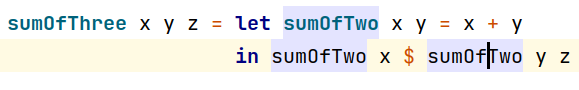
    
  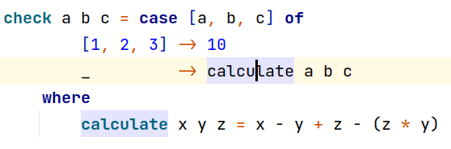
    
  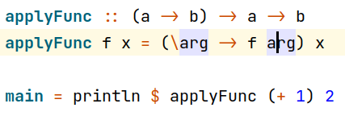
    

- Navigation depends on imports
    
  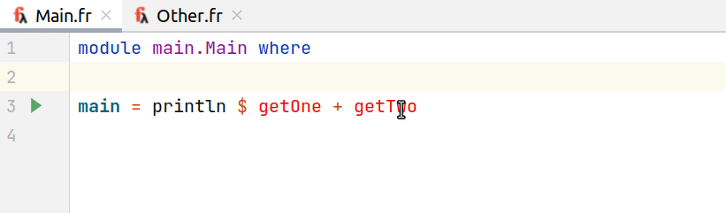
    

- Navigation to Java (and other JVM-languages)
    
  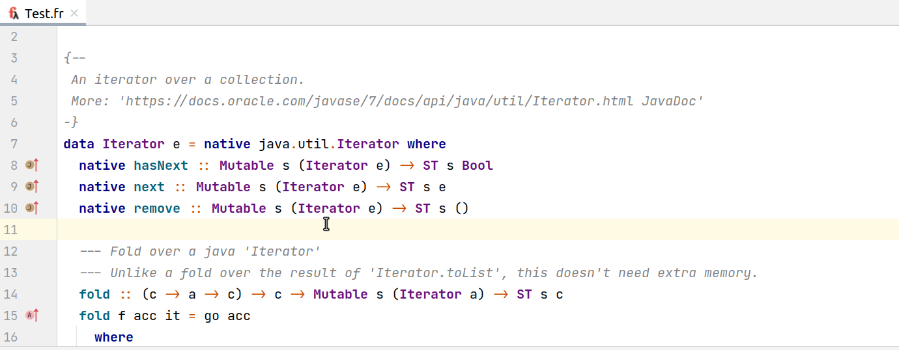
    

- Navigation from Java (and other JVM-languages)
    
  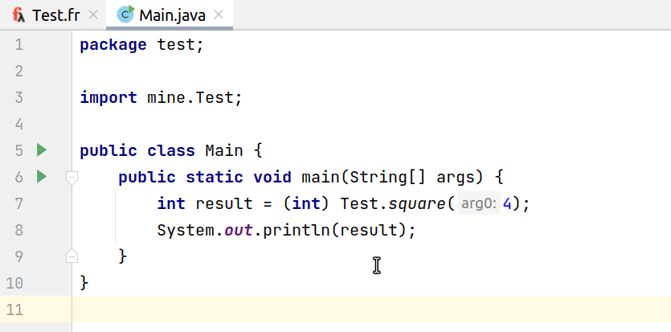
    

- Line markers
  - To type annotation
      
    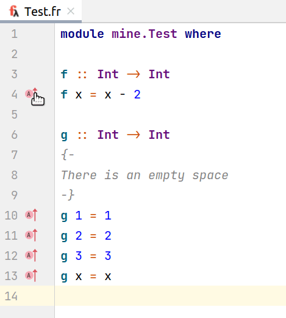
      
  - To instanced methods and vice versa
      
    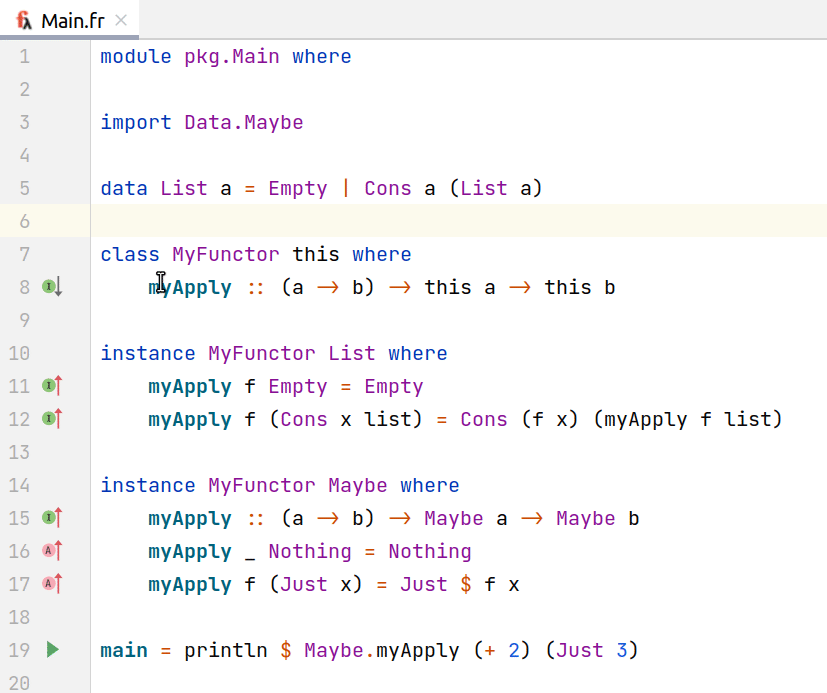
      
  - Run Frege
      
    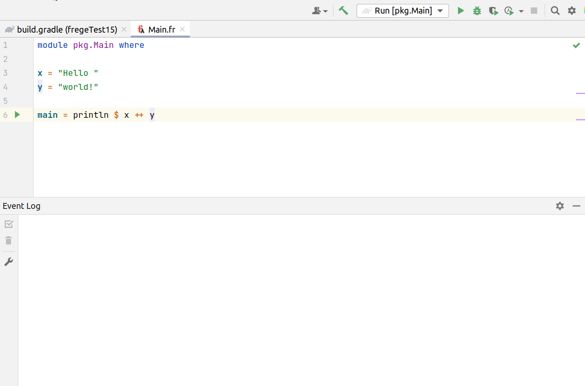
      

- Find usages
    
  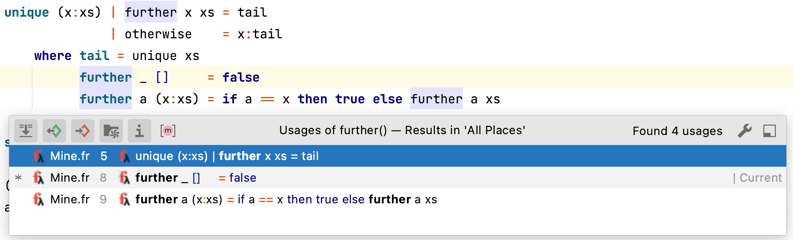
    

- Autocompletion
    
  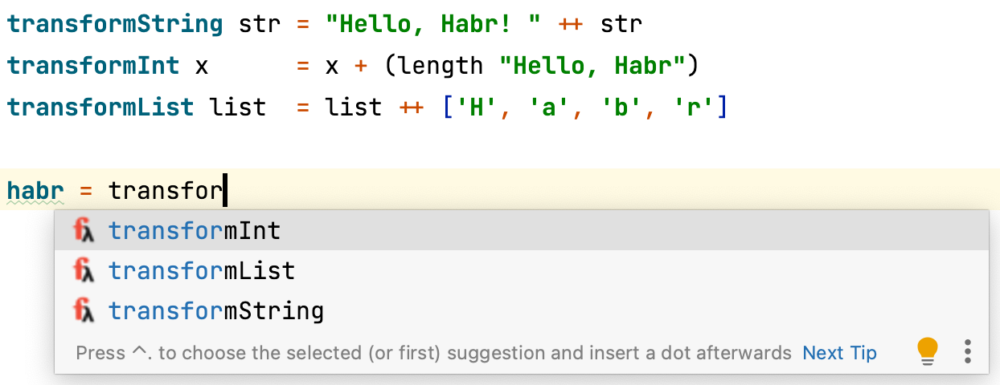
    
  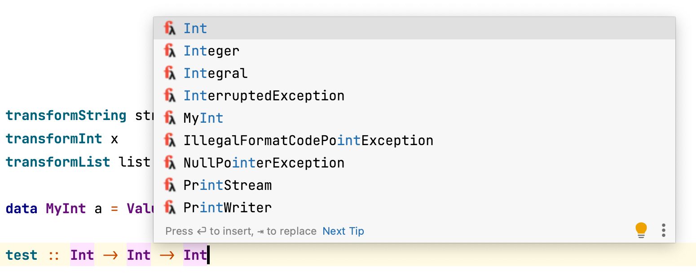
    
  
- Rename refactoring
    
  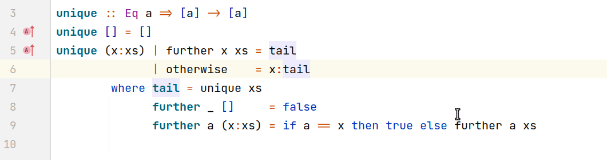
    

- Add import quickfix
    
  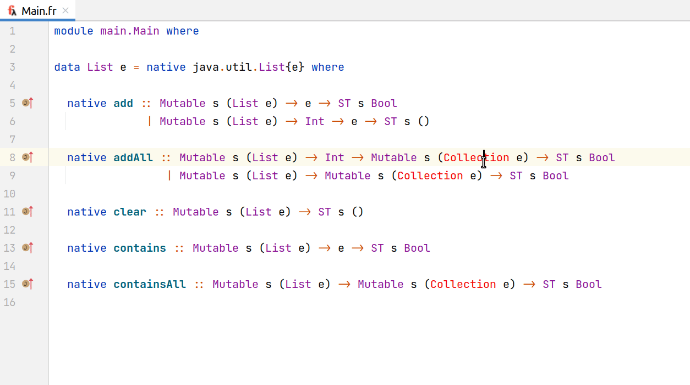
    

- Documentation viewer
    
  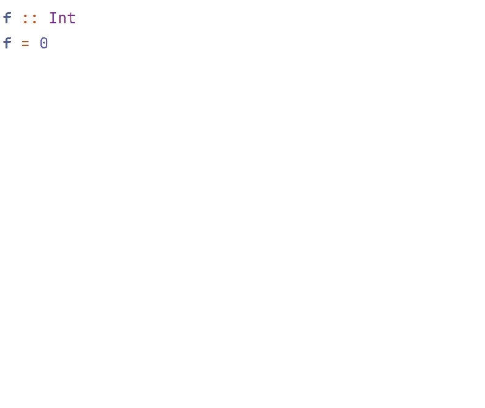
    

- REPL integration
    
  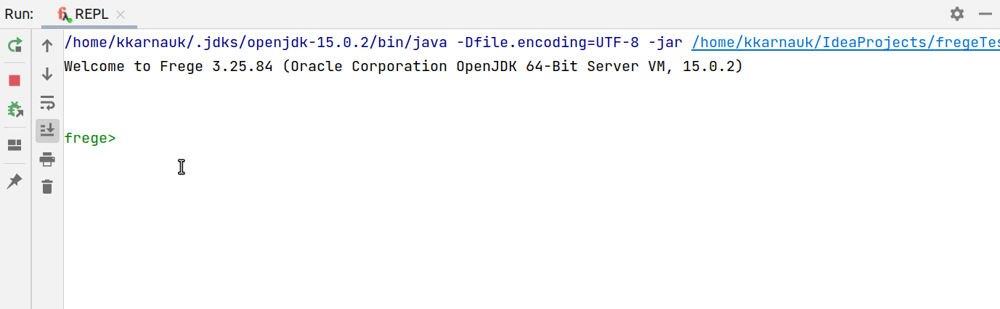
    

- REPL: execute parts of code
    
  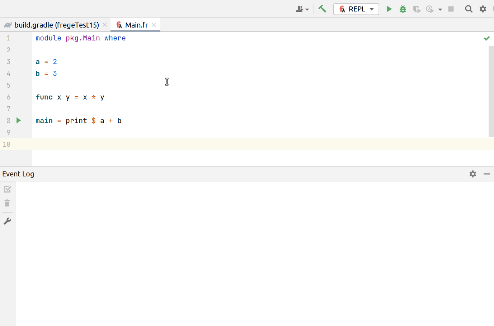
    
  

## Contributors

[Peter Surkov](https://github.com/psurkov/)

[Kirill Karnaukhov](https://github.com/kkarnauk)

[Jura Khudyakov](https://github.com/23jura23/)

Special thanks to [Semyon Atamas](https://github.com/satamas) and [Dierk König](https://github.com/Dierk)!

## License

Apache-2.0
